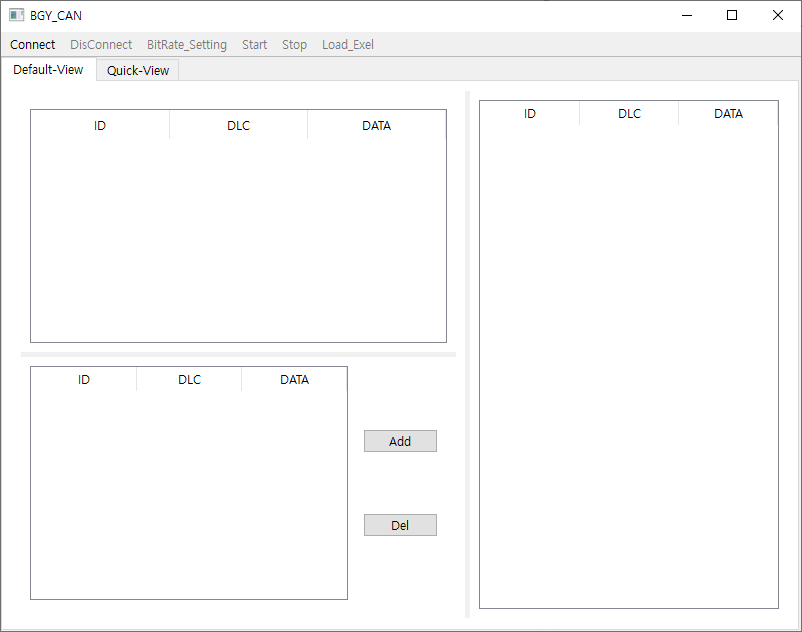
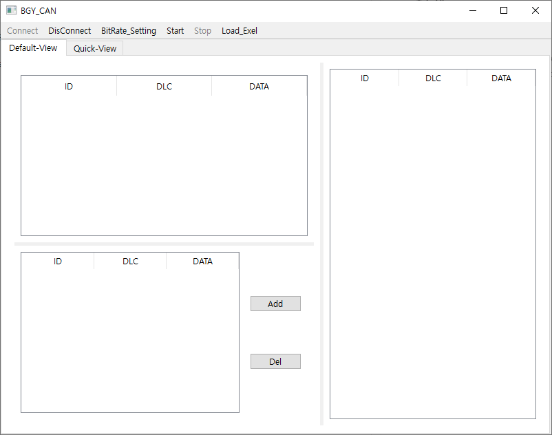
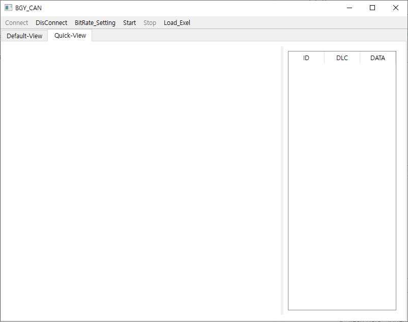
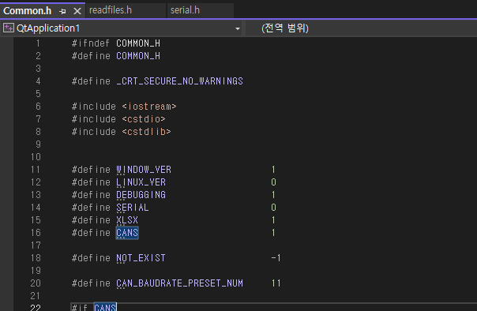
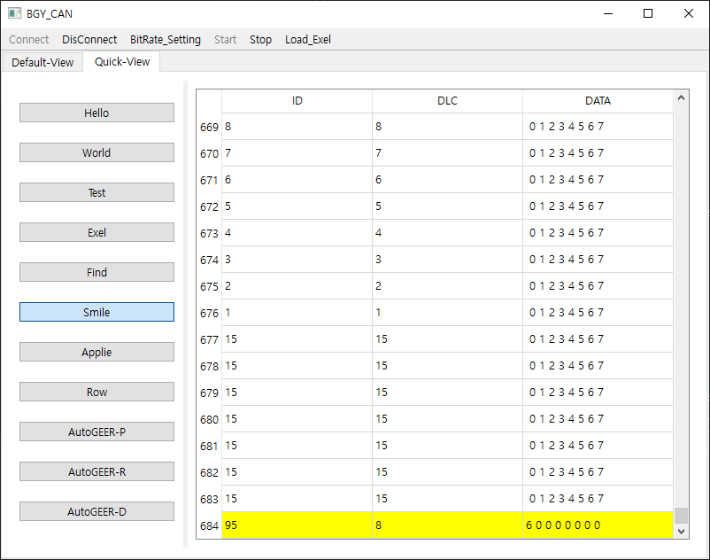
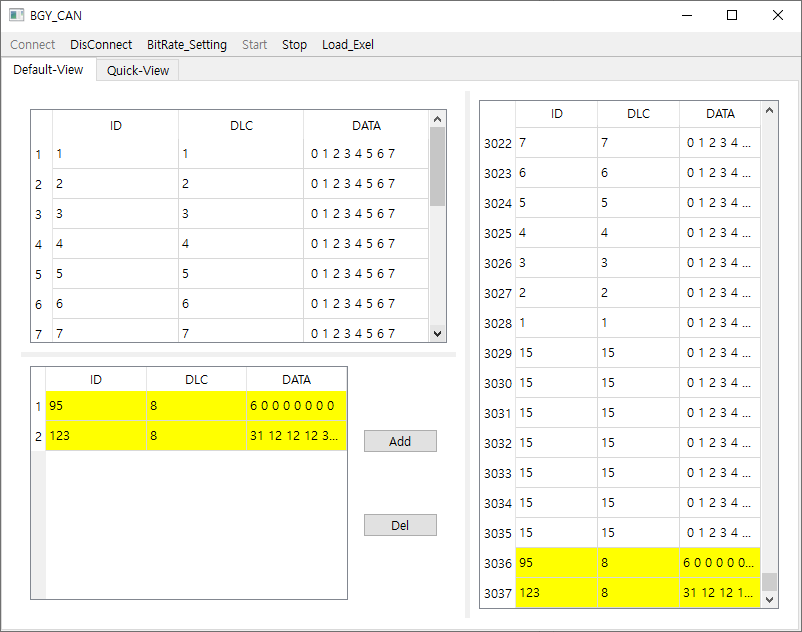

# BCAN v1.0
## CAN Control Interface Program (Window)
* date : 2024-05-10 ~ 2024-05-24

### Main Frame

#### ToolBar Function
* Connect : Device Connect
* DisConnect : Device DisConnect
* BitRate
  *   High-CAN : 500 bps
  *   Low-CAN : 125 bps
* Start : start
* Stop : Stop
* Load_Exel : Load Exel
#### TAB-View

* Default-View
  *  Read Layout : Sorted Rx Data Window
  *  Write Layout : Add Tx Data Window
  *  Trace Layout : Rx-Data & Tx-Data
* Quck-View
  * Button Layout : reading exel-cell make button
  * Trace Layout : Rx-Data & Tx-Data
  
### Debugging Mode
  

Change Debugging in Common.h (1 or 0)

